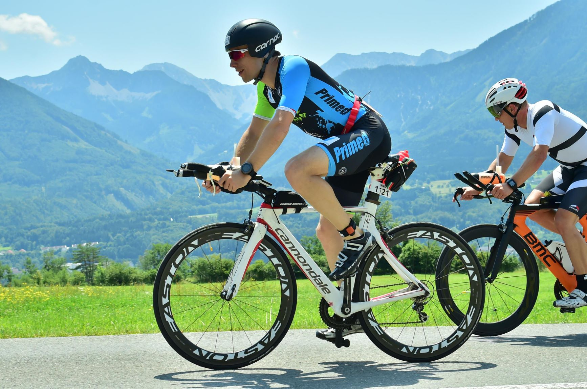

Austria 2017 wasn't meant to be after breaking my back snowboarding in January, so instead I spectated and having already decided against Austria 2018, the temptation of much of Pulse club registering the next day proved too much. 

Start of 2018, strictly no snow activities, and I decided after seeing decent improvement since moving to long distance triathlon I'd opt for a coach to help address weaknesses. I had a good swim and run at IM Wales the previous year but the bike was disappointing (6:40). I had a sub 10 in mind for Austria and picked up a second hand Cannondale Slice TT bike and some aero wheels. I was also registered for London marathon in April so focused on the bike in Jan and Feb and moved over to long hill runs ahead of London. Sub 3hr was on the cards but a combination of sickness leading up to the race and hot conditions on race day meant I seriously overheated 25km into the run after which point it was a case of just getting to the finish. I can't remember crossing the finish line and was delirious as medics tried to cool me down. Not a good start and a serious question mark over whether I can handle heat, like Austria might experience.  A few weeks later I managed to completely mess up my nutrition at the double Olympic in Athy; after a decent bike and start to the run I rapidly faded to a walk/run effort. So not the smoothest lead up but I wanted to make sure that i learnt from my mistakes namely factoring in race conditions for pace, and controlling nutrition and hydration. For the latter I bought all the Enervit nutrition that would be available on the bike course, increased my electrolyte intake in training, and figured out how to fit it all to the bike.

I flew out to Munich Friday morning and was relieved to have my bike box rolled over to me at the other end. I then rented a car and after some confusion escaping Munich with its orbital motorway closed I made it to Klagenfurt 5 hours later and just in time for registration. Saturday revolved around trying out the canal part of the swim early with the sunrise, reconstructing the bike, doing a quick brick in what was now 30 degrees heat. Two quick takeaways: black aero helmet without visor is cool enough once you get moving, and saddle mounted bottle cages require some practice (half of the session was spent in a lay by doing circles until I had this figured out).

Race day, 3:30AM alarm and hotel kindly put on breakfast. Two other couples were competing it was perfect distraction with both being seasoned IM participants reassuring you that this is completely normal. It was a 20 min drive out to the spot I'd found by chance the previous year and the scenic drive through mountains helped ease the nerves. On reflection it's not the best place to park but it was one less variable to worry about and the walk over kept me occupied. Previous day transitions are easy to prepare for having done everything the day before, so you end up busying yourself with last minute changes. Definitely worth minimising last minute changes! I forgot my power meter battery but figured this was lower on the priorities and reverted to heart rate for the race.

I joined the massive queue for restrooms, which ended up leaving a couple of minutes to get to the swim start. The gun for the pros went off while I was standing in line, and I started to worry but it proved a good distraction and I bumped into my old boss for quick chat. I finally ran over to the swim start and we started to enter the water. The first 500m of the swim always makes me question why i put myself through such stress and you just have to keep reminding yourself that this will pass after the first buoy. I started in the <1:10 group and emerged after 1:09, previous shorter distance races had me at slower paces so it's so good knowing you can find some feet and stick with them for the whole distance. I hadn't properly tested some new mirror goggles and one of my contacts got away 5 minutes into the swim.

No issues in transition: I had picked out some landmarks for the bike for a change and was soon out of T1. The course was already busy heading out and it was hard to hold back with HR hitting 150 for first 10min. This soon decreased to 135 and based on Wales the previous year I knew this was manageable and that I should be wary of this dropping on the in the second lap. The bike course in Austria is stunning and there is great support on the hills, although Wales still has the edge. Following on from Oliver's nutrition video, I had 3 Cliff bars broken into pieces with a watch reminder every 15 min to fuel/hydrate. The on course isotonic is really dilute so I picked up 3 x 500ml bottles after each hill. I assumed any time gain would be due to my eager start but on reflection I was 12 minutes slower for the second lap over the course so pacing could have been better (most people experienced significant laps though as wind picked up). (5:19)

At the end of the bike leg while others were unclipping on the bike I didn't twig but was otherwise quick enough out of T2 and legs felt decent for the run. Run course is a 5km out and back in either direction, with 3 opportunities to pass by the finish line, nice touch. Only thing worse than a morning hot marathon is one starting in the heat of the day however all fears were dispelled when I reached the first aid station and discovered cups of ice and sponges...this would have been amazing in London. Heart rate barely crept above 140 and I fell into a keen 4:45/km pace with the real chance of a sub 10. 

I managed to maintain the pace without increasing HR for first 23km but the second half involved a lot more walking through aid stations and while the pace was still there, my average reduced from 4:50km/min to 5:21km/min ~11min. I also really appreciate all the Pulse support out on the run course; it makes all the difference particularly when you know when to expect it.

My swim was also much slower relative to my age group so I feel I could have made up a few minutes there. I'm delighted with the time, it wasn't a sub 10 but if I'd pushed it on the run like in London it may have been much worse and I was able to enjoy some sightseeing in Munich the following day. 
